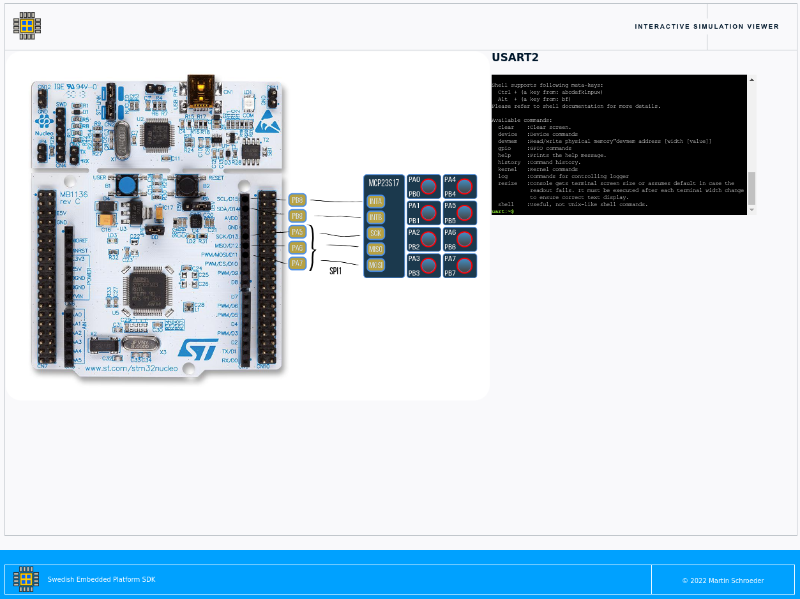

.. SPDX-License-Identifier: Apache-2.0
   Copyright 2022 Martin Schröder <info@swedishembedded.com>
   Consulting: https://swedishembedded.com/go
   Training: https://swedishembedded.com/tag/training

*********************************************************
Embedded Firmware Development, Simulation and Testing SDK
*********************************************************

**Swedish Embedded Platform SDK** is a comprehensive platform for firmware
development. It provides:

- **Extensive hardware platform support**: so you can cross compile your firmare
  easily. Using this SDK you can build your code in a truly portable fashion.
- **Powerful CI infrastructure**: with comprehensive testing and verification
  capabilities so your team can work much faster and be more agile. You team can
  focus on writing good code.
- **Simulation and visualization**: run your firmware on simulated hardware for
  debugging, PoC and verification (simulations can be automated and run in CI).
  Custom simulation environments and testbenches can also be added.
- **Application development**: infrastructure for easily importing this SDK into
  your application and using it to build your next product.

Easy to get started
###################

A development docker image is provided:

- **Development Docker image (dockerhub)**: swedishembedded/develop:latest

Using this image you can build and run an application very quickly:

.. image:: doc/img/docker-demo.gif

.. code-block:: bash

    docker pull swedishembedded/develop:latest
    # Run in privileged so we can flash over USB JTAG
    docker run -t -i --privileged \
        -v /dev/bus/usb:/dev/bus/usb \
        swedishembedded/develop:latest
    SDK> workspace demo
    SDK> west build -b stm32f429i_disc1 -s ../zephyr/samples/basic/blinky -t flash

Extensive hardware support
##########################

This SDK uses Zephyr RTOS kernel - which is a highly capable and stable realtime
kernel for realtime industrial applications. With this you also get extensive
and continuously evolving hardware support delivered to you through the open
source community.

This includes:

- **700+ device drivers**: for everything from buttons to advanced LoRaWAN modem
  chips. Swedish Embedded can develop new drivers for you on demand.
- **420+ boards**: this includes a large number of development and prototyping
  boards. New boards can be added on demand as well.
- **Extensive HAL support**: included as a module and supports variety of SoC devices
  including NXP and STM32.
- **Library support**: develop graphical applications based on powerful LVGL
  library which is included and easy to enable in the build process.

Powerful CI infrastructure
##########################

This builds even further on the powerful Zephyr CI infrastructure and adds the
following features:

- **Advanced unit test mocking ability**: so that you can write unit tests that
  can reach all code regardless of what software component you are testing.
- **RobotFramework testing support**: allowing you to write tests in plain
  english and extend them with python. This is applicable to all parts of the
  repository (see scrum directory).
- **CI simulation infrastructure**: allowing you to write tests in
  RobotFramework that run against production firmware in a simulated
  environment. This gives you a very powerful way to test your whole application
  stack automatically.

The simulation framework supports multi-node simulation meaning that you can
test complete aggregations of devices using the Swedish Embedded Platform SDK
upon every commit being created in your repository.

Integrated Control Toolbox
##########################

[Swedish Embedded Control Toolbox](https://github.com/swedishembedded/control)
is integrated into this SDK, meaning that you have access to fast
implementations of control system design and system identification algorithms.
If you are using Swedish Embedded SDK for developing industrial automation
systems then the control toolkit is very useful.

- **Filtering** - pure C Kalman filter and the new Square Root Unscented Kalman
  Filter implementations.
- **System Identification** - so you can identify models of your system dynamics
  in realtime directly inside your firmware without any external dependencies.
- **Controller Design** - functions for implementing model based controllers for
  dynamic systems.

Find out more at: https://github.com/swedishembedded/control

Simulation and visualization
############################

Another major component used in this SDK is the renode simulation framework.
Renode is a specialized simulator used for advanced FPGA design and supports
cosimulation of hardware models together with firmware.

Renode also supports:

- **40+ simulation platforms**: and we can easily build simulation for your
  board as well.
- **Scripting in python and C#**: making it easy to add simulation capabilities
  that are unique to your application (such as dynamic modeling).

Visualization testbenches can be created to visualize your PCB and interact with
virtual controls:

You can also cosimulate your peripherals using standalone executables. The way
this works is that we map a simulation executable into the address space of your
MCU so that when anything is written or read to and from that memory, the
read/write request is handled by a standalone program connected to the
simulator. You can have as many standalone executables as you have peripherals.

This allows you to implement simulated peripherals that support user interaction
(you can of course run automatic simulations as well - but sometimes user
interaction is userful).

.. image:: samples/lib/control/dcmotor/doc/screenshot.png

To build the above example you need to do two things:

- Install control toolkit locally from https://github.com/swedishembedded/control (cmake && make install).
- Install instruments from https://github.com/swedishembedded/instruments (cmake && make install). This will give you /usr/bin/instrument-dcmotor.

After that you can build and run the sample:

..
    west build -p -b custom_board samples/lib/control/dcmotor/
    west build -t appbench

Learn more
##########

- **Swedish Embedded Platform SDK**: https://swedishembedded.com/sdk
- **Discord community**: https://swedishembedded.com/community
- **Learning resources**: https://swedishembedded.com/tag/training
