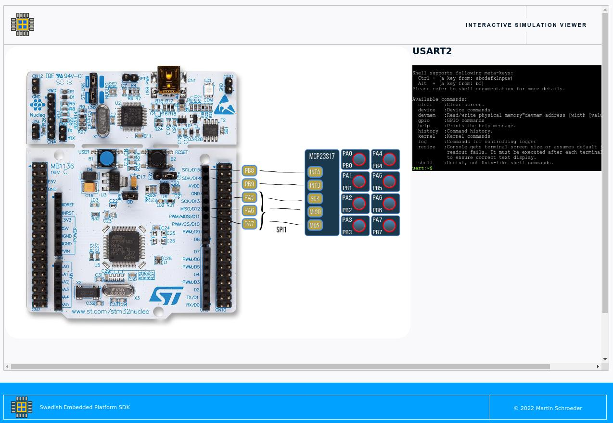

.. SPDX-License-Identifier: Apache-2.0
.. Copyright 2022 Martin Schröder <info@swedishembedded.com>
   Consulting: https://swedishembedded.com/go
   Training: https://swedishembedded.com/tag/training

Testing
*******

This board does support a testbench. This testbench supports simulated mcp23s17
peripheral connected to the board.

You can run the testbench example as follows:

.. code-block:: console

	west build -p -b custom_board samples/drivers/gpio/mcp23s17 -t testbench

Then point your browser to localhost:8000 to view the testbench interface.

To interact with the USART use "uart_connect sybus.usart2" in the monitor
window.
