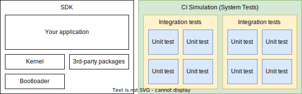

.. SPDX-License-Identifier: Apache-2.0
.. Copyright 2022 Martin Schröder <info@swedishembedded.com>
   Consulting: https://swedishembedded.com/go
   Training: https://swedishembedded.com/tag/training

..
    Platform SDK documentation main file

.. _zephyr-home:

Swedish Embedded Platform SDK Documentation
###########################################

.. only:: release

   Welcome to the Swedish Embedded Firmware And Simulation Platform SDK
   documentation version |version|.

.. only:: (development or daily)

   **Welcome to the Swedish Embedded Firmware And Simulation Platform SDK
   documentation for main tree under development** (versoin |version|).

Swedish Embedded Platform SDK provides a full development environment for
building connected IoT devices. It consists of:

- **Bootloader**: MCUBoot

- **Kernel**: powerful Zephyr RTOS kernel with support for over 400+ platforms.

- **Testing framework**: CMock and Unity unit testing optimized for embedded
  firmware development.

- **Simulator**: Integrated renode simulation for state of the art automated
  testing.

Testing and verification of physical embedded systems is often difficult due to
poor reproducibility and lack of insight into the current state of the system,
especially in multinode scenarios (sensors connected to a central and scenarios
involving mesh networks).

Yet embedded devices often handle critical tasks and all functionality of the
embedded device must therefore be thoroughly verified. The only way we can
achieve this is through a properly setup continuous integration pipeline which
runs scenarios against final production software. But traditionally this has
been very hard because embedded software has to be cross compiled and needs
real hardware to work.

Swedish Embedded SDK closes these gaps that were preventing you from achieving
100% verifiability of all levels of your software. With simulation we can
capture all user requirements and run them continuously each time changes to
the software are made. With powerful mock-based unit testing, we can test every
little corner of your application logic and verify that the lowest level logic
is correct.

When we combine high level scenario testing, mid-level integration testing and
lowest level unit testing - we are able to achieve 100% robustness and
stability of your embedded software.

Swedish Embedded Platform SDK combines all the tools you need to in order to
achieve this effectively and without sacrificing portability of your code to
future hardware.

You can build your production firmware, run all unit tests and then run the
signed unmodified binaries, identical to the ones that you would normally flash
onto your target hardware, on a virtual board or system of boards and verify
user scenarios completely automatically, on CI server, each time anyone on your
team submits a merge request.

One important aspect of our simulation approach is that it simulates not only
CPUs but entire SoCs (including e.g. heterogeneous multicore SoCs and various
peripherals) as well as the wired or wireless connections between them, which
allows users to address complex scenarios and test real production software.

By using Zephyr RTOS kernel as our kernel of choice, we are able to meet all
major challenges of continuously evolving IoT landscape and provide you with
solutions that are truly future-proof.

.. toctree::
   :maxdepth: 2
   :caption: Sections

   introduction/index.rst
   workflow/index.rst
   control/index.rst
   boards/index.rst
   drivers/index.rst
   lib/index.rst
   testbench/index.rst
   samples/index.rst
   simulation/index.rst
   release-notes/index.rst

Indices and Tables
******************

* :ref:`genindex`

.. _Apache 2.0 license:
   https://github.com/zephyrproject-rtos/zephyr/blob/main/LICENSE

.. _GitLab repo: https://gitlab.com/swedishembedded/platform/sdk

