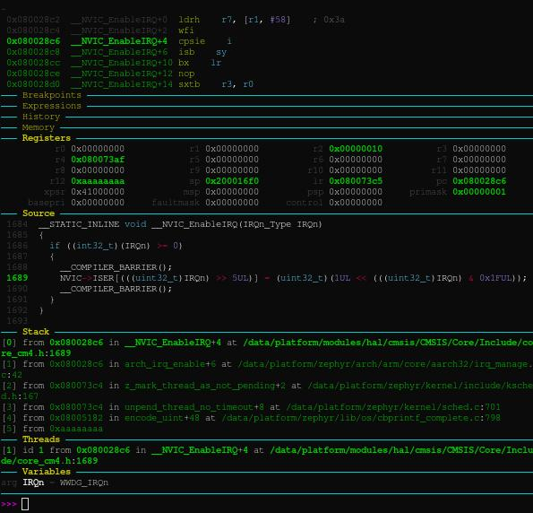

.. SPDX-License-Identifier: Apache-2.0
.. Copyright 2022 Martin Schröder <info@swedishembedded.com>
   Consulting: https://swedishembedded.com/go
   Training: https://swedishembedded.com/tag/training

Debugging your application
==========================

You can debug your application inside a simulation by simply starting up the
debugserver inside the simulation monitor window:

.. code-block:: shell

	(machine-0) machine StartGdbServer 3333

You can then do debugging using any IDE that supports a remote debugger
connection (since you are simulating, it has to be remote - the process is the
same as for debugging application over JTAG).

Personally I use GDB dashboard (https://github.com/cyrus-and/gdb-dashboard)
which gives me full functionality of GDB but also with a python prompt.

You can start debugging on any testbench regardless of whether it's app
testbench, board testbench or custom testbench. The commands are created for you
and are suffixed with debugserver suffix:

.. code-block:: shell

	west build -b boardbench_debugserver

This launches the board testbench and starts a gdb server as well.

You can now debug the application using gdb dashboard. The dashboard is
accessible through "debug" alias command inside the docker image. It accepts the
same arguments as gdb, but also loads the graphical interface which makes
debugging easier:

.. code-block::

	debug build/zephyr/zephyr.elf

Once you are inside gdb, you need to tell it which running instance to debug.
Since we have a gdb server running inside the simulator, we can connect to it
like this:

.. code-block::

	(gdb) target remote :3333

Renode commands are now accessible from GDB using the "monitor" command (or
"mon" for short):

To get help on the available commands you can type:

.. code-block::

	(gdb) mon help
