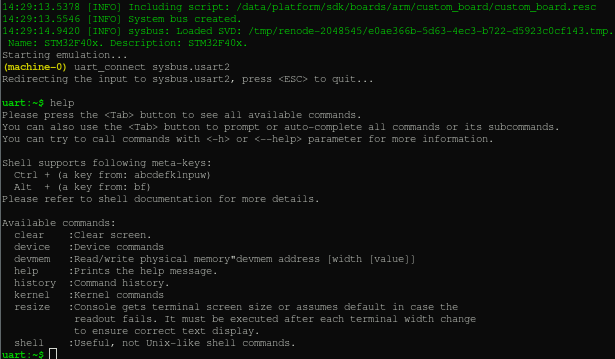

.. SPDX-License-Identifier: Apache-2.0
.. Copyright 2022 Martin Schröder <info@swedishembedded.com>
   Consulting: https://swedishembedded.com/go
   Training: https://swedishembedded.com/tag/training

Setting up a new project
========================

After installing the SDK or starting the docker image, you should have a
workspace directory structure that looks like this:

.. code-block:: text

	.
	├── .west
	├── app <- your application
	├── bootloader
	├── modules
	├── sdk
	├── tools
	└── zephyr

Here you have the SDK, modules and Zephyr kernel source code.

You project should be created inside this workspace directory. This is
important, because the west tool used for building takes its configuration from
the .west directory in this tree (it looks in parent directory for this config).

Your application can be a separate git repository, but you should check out this
repository into this workspace. It is possible to do this automatically using a
standalone west.yml manifest that contains all of your projects, but we can do
this later since we already have a west.yml file inside the sdk that we use
instead.

Create directory in your workspace and go to it (you can do this inside the
docker image):

.. code-block:: shell

	cd /build/platform && mkdir app && cd app

Create your main.c file:

.. code-block:: c

	mkdir src
	cat > src/main.c
	#include <kernel.h>
	void main(void){
		printk("Hello world!\n");
	}

(you can use 'cat' command like this and press C-d when you are done to exit)

Create a project configuration file:

.. code-block:: text

	cat > prj.conf
	CONFIG_SHELL=y

Here we will include shell into our app so that we can connect to it over a uart
and run basic shell commands. The shell module is provided by Zephyr and this
way of enabling shell functionality shows just how modular and flexible the
process of working with this SDK is in practice.

Next we create a CMakeLists.txt file that will be used to build our project:

.. code-block:: text

	cat > CMakeLists.txt
	cmake_minimum_required(VERSION 3.13.1)

	find_package(Zephyr REQUIRED HINTS $ENV{ZEPHYR_BASE})
	project(app)

	target_sources(app PRIVATE src/main.c)

This is all you need to start building your application. We can now build this
project for any one of the 400+ boards. You can see all available boards like
this:

.. code-block:: shell

	west boards

For this example, we are going to build the project for the custom board
provided in the SDK since it defines testbench functionality and simulation.

.. code-block:: shell

	west build -p -b custom_board .

We can now run the application in the default simulation provided by the board.

.. code-block:: shell

	west build -t boardbench

This will load and run the new STM32 binary on the basic simulation setup
provided by the custom board definition (under
boards/arm/custom_board/custom_board.resc):

You can now start a GDB server inside the simulation and connect to it if you
want:

.. code-block:: shell

	(machine-0) machine StartGdbServer 3333
	# ... in another termina start gdb:
	(gdb) target remote :3333

This gives you full debugging capabilitites inside the simulation. The simulator
acts as "debug monitor" (just like your JTAG adapter) and is accessible from GDB
using the "mon" command (try "mon help" and it will be the same output as you
get when you type "help" in the simulator prompt.

This means that you have full access to all simulation parameters, buttons and
peripheral functions from inside GDB (including peripherals that are "connected
to the board" - outside of the CPU).
