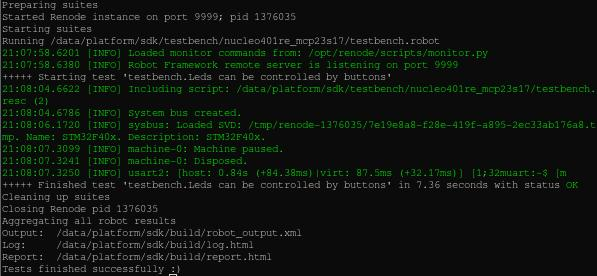

.. SPDX-License-Identifier: Apache-2.0
.. Copyright 2022 Martin Schröder <info@swedishembedded.com>
   Consulting: https://swedishembedded.com/go
   Training: https://swedishembedded.com/tag/training

Building the sample
-------------------

Build and run the sample in the simulator like this:

.. code-block::

	west build -p -b custom_board -s \
		samples/drivers/gpio/mcp23s17
	west build -t testbench

This will run the main testbench which you can access through your browser at
localhost:8000.

You can also run the automatic robot framework test using:

.. code-block::

	west build -t robotbench

This test runs fully on automatic and checks that the use case actually works
(it is also run through CI)

It uses simulation just like the test bench:

