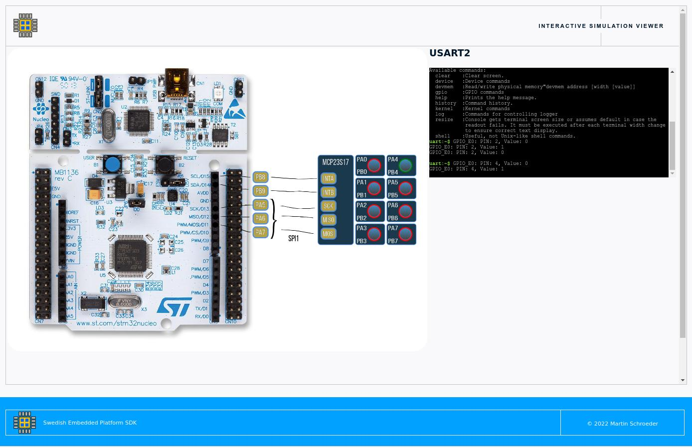

.. SPDX-License-Identifier: Apache-2.0
.. Copyright 2022 Martin Schröder <info@swedishembedded.com>

Nucleo401RE MCP23S17 Testbench
##############################

This testbench is a simple setup with an STM32F401RE board connected to an SPI
GPIO expander. This test bench uses websocket to interface with the simulation.

The GPIO expander PORTA is connected to 8 buttons and PORTB is connected to 8
LEDs.

The testbench is suitable for running the mcp23s17 driver sample:

.. code-block::

	 west build -p -b custom_board samples/drivers/gpio/mcp23s17 -t testbench

You may need to start the visual server (if it doesn't start automaticallY):

.. code-block::

	 startVisual 8000

Now you can access the testbench through "localhost:8000" address.

This testbench demonstrates a simple way to create visualizations for your
product using javascript. This has the advantage of allowing you to use mature
web frameworks like jQuery for controlling your UI elements.
